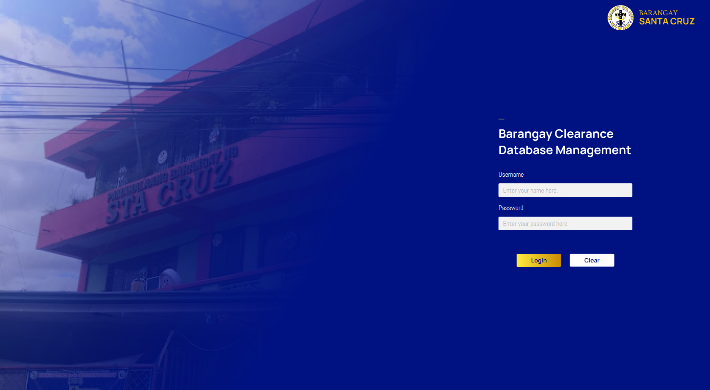
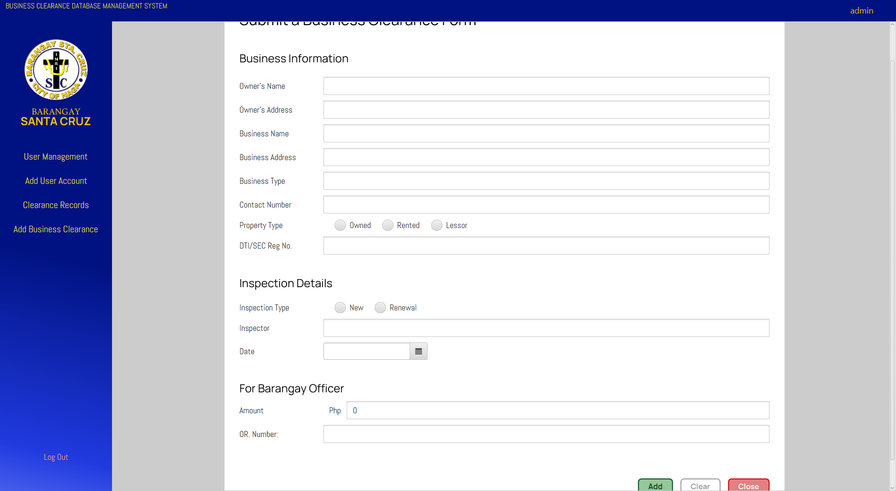

# Database Management System Project

This project is a course work submission for the Object Oriented Programming (OOP) course.

## Screenshots

## Project Overview

The project is composed of two modules: User Management and Data Entry modules.

### User Management Module

#### User Account Management

Create, read, update, and delete (CRUD) user accounts.

#### User Login and Authentication

Authenticate users using username and password.

### Data Entry Module

#### Business Clearance Entry

Create, read, update, and delete (CRUD) business clearance entries.

#### Business Clearance List

View list of business clearance entries.

## Technologies Used

The project uses the following technologies:

-   Java 11
-   JavaFX 13
-   SceneBuilder 23.0.1
-   Maven
-   MySQL Server 8.0
-   Visual Studio Code 1.96.2

## How to Run

To run the project, use the following command: `mvn javafx:run`

## How to Build

To build the project, use the following command: `mvn clean package`

## Database Schema

The project uses a MySQL database to store data. The database schema is defined in the `database` package.

## JavaFX Controllers

The project uses JavaFX controllers to manage the user interface and handle user interactions. The controllers are defined in the `com.dbms` package.

## Utilities

The project uses several utility classes to perform tasks such as throwing alerts and validating user input. These classes are defined in the `com.dbms.utils` package.

## Models

The project uses several model classes to represent data entities, such as user accounts and business clearance entries. These classes are defined in the `com.dbms.models` package.
